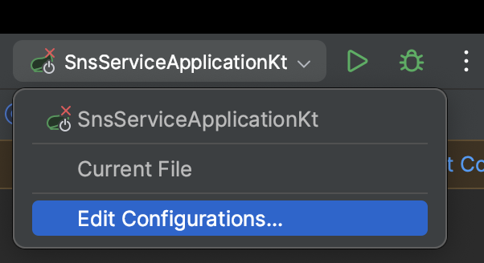
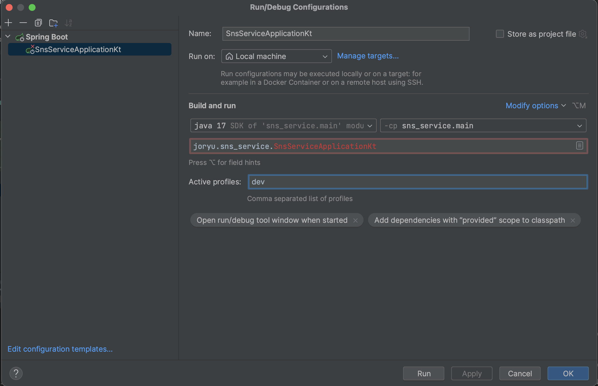

# Websocket Simple Test

1. ## Click `Edit Configurations...`

2. ## Input `local` in 'Active profiles'

> local 프로필로 실행하면 h2 db를 사용해 MySQL의 실행 없이 간단한 테스트가 가능합니다.

3. ## Run!

4. ## Open `front-test-bed/index.html`